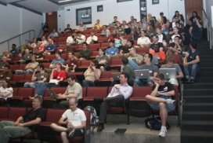
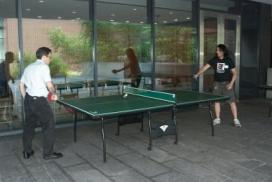

# What's Scalathon?

Scalathon is an opportunity for the Scala community to come together and improve the Scala ecosystem over two jam packed days.

* **Scalathon is about code.**
* **Scalathon is social.**

## Scalathon may be for you if...

* You're looking to get involved in an exciting project.
* You'd like to improve your Scala by working with the best developers from around the world.
* You're looking for new collaborators on your existing project.
* You think Scala could be better documented.
* You want to promote your awesome library.

# Event outline

## Friday

On Friday, [Typesafe](http://typesafe.com/) will be holding a 2-hour
business session. Details and registration will be coming soon.

## Saturday

Saturday we'll be hacking all day. Saturday evening, 
[Novus Partners](http://www.novus.com/) will be sponsoring dinner and drinks.

Throughout the day there will be short talks, from representatives of various
[Scala projects](projects.html). These talks are all about welcoming newcomers
to the project.

Many of these talks will:

* highlight bite-sized bugs appropriate for new contributors
* give a crash course on the project's source code
* describe the project's build-modify-publish chain

We are hoping to provide breakfast and lunch, funding permitting.

## Sunday

Sunday we'll be hacking 9am-5pm. Throughout the day there will be
[enrichment talks](talks.html).

These won't be the kind of academic talks you would see at Scala Days or the
[Northeast Scala Symposium](http://nescala.org/). Instead, they will focus on
Scalathon's goal of helping Scala developers contribute to the language and its
libraries. Many Sunday talks will be tutorials on:

* advanced functional programming patterns
* Scala internals
* software best practices
* open source dynamics and community building
* essential software skills 

# Our suggestion on the talks...

... is to not go to too many of them. Remember, Scalathon is all about 
hacking, something you can't do if you're stuck in a lecture hall all day. All
talks will be recorded and posted on Vimeo.com after the event. So our advice
is to go to a couple talks each day and save the rest for home.

